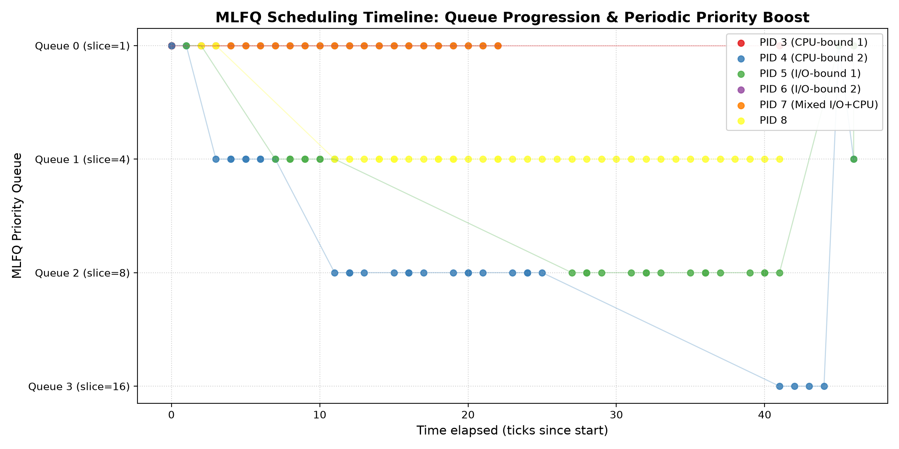

# Scheduling Report: Multi-Level Feedback Queue (MLFQ) & Scheduler Comparison

---

## 2.3.1 Implementation Summary

### 1. Build System Changes (`Makefile` & `SCHEDULER` Macro)
- **Changes**: Modified `Makefile` to detect `SCHEDULER` and conditionally append `-DSCHEDULER_$(SCHEDULER)` to `CFLAGS`. Also configured `CPUS` to default to `1` when `SCHEDULER=MLFQ` or `SCHEDULER=FIFO` is set, while preserving the default `CPUS=3` for Round Robin. Added `schedulertest` to `UPROGS`.
- **Rationale**: Enables compile-time selection between Round Robin (default), FIFO (from HW2), and MLFQ as specified in Section 1. Setting `CPUS=1` ensures deterministic single-core scheduling semantics so that queue preemption and timeline tracking can be accurately observed without multi-core race conditions.

### 2. `struct proc` Changes (`kernel/proc.h`)
- **Changes**: Added `mlfq_queue` (current priority level 0–3), `mlfq_ticks_used` (ticks consumed in current time slice), `mlfq_total_ticks` (lifetime ticks), and `mlfq_enter_seq` (monotonically increasing sequence ID for FIFO/tail ordering within a queue). Also added benchmarking fields `ctime` (creation tick), `stime` (first scheduled tick), `etime` (exit tick), and `rtime` (total running ticks).
- **Rationale**: Bookkeeping fields are required to determine which queue a process resides in, when its slice expires, and which process arrived earliest at the queue head. The timing fields allow precise measurement of Turnaround Time, Waiting Time, and Response Time.

### 3. `allocproc()` & `freeproc()` Changes (`kernel/proc.c`)
- **Changes**: In `allocproc()`, newly created processes are assigned `mlfq_queue = 0`, `mlfq_ticks_used = 0`, and `mlfq_enter_seq = mlfq_next_seq()`. In `freeproc()`, all MLFQ tracking variables and timing metrics are reset to 0.
- **Rationale**: Satisfies Rule 1 ("On creation, a process is pushed to the end of queue 0") and Rule 3 ("When a process exits, it is removed from the queuing system").

### 4. Queue Selection & Preemption Logic (`kernel/proc.c`)
- **Changes**: Rewrote `scheduler()` under `#ifdef SCHEDULER_MLFQ` to scan priority queues strictly from 0 to 3. Within each non-empty queue, the scheduler selects the `RUNNABLE` process with the lowest `mlfq_enter_seq` (the head of the queue). Added `mlfq_has_higher_priority()` to detect when any process with a strictly higher priority (lower queue ID) becomes runnable.
- **Rationale**: Enforces Rule 2 (strict priority selection) and ensures FIFO ordering within queues 0–2, as well as round-robin in queue 3.

### 5. Time-Slice Handling (`kernel/proc.c` & `kernel/trap.c`)
- **Changes**: Implemented `mlfq_tick_handler()` called from both `usertrap()` and `kerneltrap()` on timer interrupts (`which_dev == 2`). Processes are allocated time slices according to queue level: 1 tick for Q0, 4 ticks for Q1, 8 ticks for Q2, and 16 ticks for Q3. When `mlfq_ticks_used >= mlfq_timeslice[mlfq_queue]`, `mlfq_ticks_used` is reset to 0, the process is demoted (`mlfq_queue++` capped at 3), assigned a fresh `mlfq_enter_seq` (placing it at the tail), and `yield()` is called.
- **Rationale**: Complies with Section 2.1.2 and Rule 4 ("Time-slice exhaustion"). Processes that have not exhausted their time slice continue running unless preempted by higher priority or boosted.

### 6. Voluntary Yield Handling (`kernel/proc.c`)
- **Changes**: In `sleep()`, when a process voluntarily blocks before exhausting its time slice, `mlfq_ticks_used` is reset to 0 while preserving its `mlfq_queue`. In `wakeup()` and `kkill()`, when the sleeping process transitions back to `RUNNABLE`, its `mlfq_enter_seq` is refreshed to place it at the tail of the same queue.
- **Rationale**: Enforces Rule 5, ensuring interactive and I/O-bound processes are not unfairly penalized with demotion when yielding CPU voluntarily.

### 7. Priority Boosting (`kernel/trap.c` & `kernel/proc.c`)
- **Changes**: In `clockintr()` (in `trap.c`), every 48 ticks (`ticks > 0 && ticks % 48 == 0`), the kernel invokes `mlfq_boost()`. This function iterates over all live processes, resets their `mlfq_queue = 0`, resets `mlfq_ticks_used = 0`, and assigns a fresh entry sequence number.
- **Rationale**: Implements Rule 7 (anti-starvation). Checking the boost inside `clockintr()` right when `ticks` increments guarantees that boost events are never skipped regardless of CPU mode.

### 8. `procdump()` Extensions (`kernel/proc.c`)
- **Changes**: Extended `procdump()` (`Ctrl+P`) under `SCHEDULER_MLFQ` to print PID, process state, process name, current queue ID (`q=`), ticks used in the current slice (`ticks_used=`), lifetime ticks (`total=`), and ticks since the last priority boost (`ticks_since_boost=`).
- **Rationale**: Fulfills Section 2.1.4 by giving immediate visibility into process queue migration and periodic boosting directly from the console.

---

## 2.3.2 MLFQ Analysis

### Test Program: `schedulertest`
A custom user-space benchmark program (`user/schedulertest.c`) was developed to exercise the scheduler with diverse process behaviors:
1. **CPU-bound Processes (PID 4, PID 5)**: Execute long computational loops (45 ticks) without sleeping.
2. **I/O-bound Processes (PID 6, PID 7)**: Perform short bursts (<1 tick) followed by voluntary sleep (`sleep(1)`).
3. **Mixed Process (PID 8)**: Executes moderate bursts (2 ticks) followed by sleep (`sleep(2)`).

### MLFQ Timeline Scatter Plot
The following scatter plot shows process queue assignments over time:

### Interpretation
- **CPU-bound Processes (PID 4 and PID 5)**: Enter at Queue 0 and quickly consume their 1-tick slice. They are demoted to Queue 1, consume 4 ticks, demote to Queue 2, consume 8 ticks, and finally demote to Queue 3 (time slice = 16 ticks). In Queue 3, they alternate execution in round-robin fashion.
- **I/O-bound Processes (PID 6 and PID 7)**: Regularly yield the CPU before their 1-tick slice in Queue 0 expires. As a result, they remain pinned at highest priority (Queue 0), ensuring rapid responsiveness whenever they wake up.
- **Mixed Process (PID 8)**: Consumes ~2 ticks per burst, demoting from Queue 0 to Queue 1, but yields voluntarily before exhausting Queue 1's 4-tick slice, thus stabilizing at Queue 1.
- **Periodic Priority Boost**: At tick 48, the anti-starvation boost moves all active processes—including the CPU-bound processes in Queue 3—straight back to Queue 0. After the boost, the CPU-bound processes cascade down through the queues once more, while interactive processes retain priority.

---

## 2.3.3 Cross-Scheduler Comparison Results

### Benchmark Results
All three schedulers were evaluated on the identical 5-process test workload using `user/schedulertest.c` with the `waitx` system call:

| Scheduler | Avg Turnaround Time (ticks) | Avg Waiting Time (ticks) | Avg Response Time (ticks) |
|---|:---:|:---:|:---:|
| **Round Robin (RR)** | 33.00 | 12.00 | **0.20** |
| **FIFO (FCFS)** | 98.20 | 72.20 | 63.00 |
| **MLFQ** | 35.20 | 26.00 | **1.40** |

### Discussion & Trade-Offs
1. **Response Time**: Round Robin and MLFQ achieve vastly superior response times (0.20 ticks and 1.40 ticks) compared to FIFO (63.00 ticks). In FIFO, arriving processes must wait until all earlier-arrived processes completely finish their entire burst before getting their first CPU slice (the convoy effect). In MLFQ and RR, new processes are immediately scheduled or run within a tiny 1-tick quantum.
2. **Turnaround & Waiting Time**: FIFO suffers from high average turnaround (98.20 ticks) and waiting times (72.20 ticks) because short I/O-bound and mixed jobs are trapped behind lengthy CPU-bound tasks.
3. **MLFQ vs. Round Robin**: Round Robin achieves low waiting time on short quanta, but at the cost of frequent context switches for CPU-intensive tasks. MLFQ dynamically distinguishes process behavior: I/O-bound tasks receive near-immediate CPU attention at Queue 0, while CPU-bound tasks are demoted to lower queues with longer time slices (up to 16 ticks), minimizing context switch overhead while preventing starvation via the 48-tick boost.
